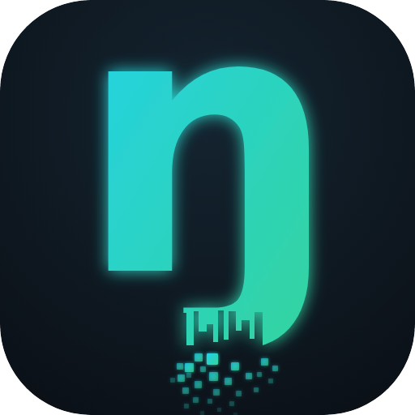
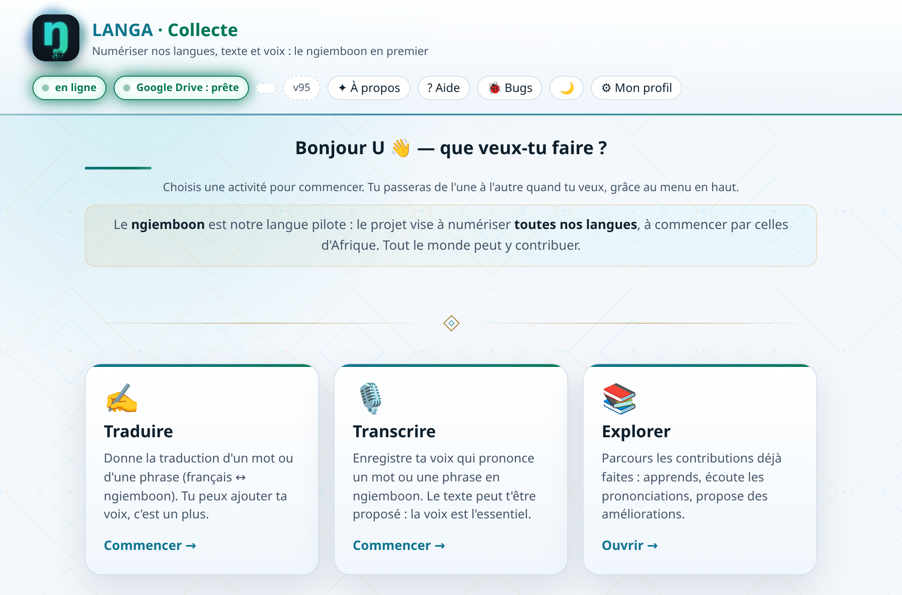
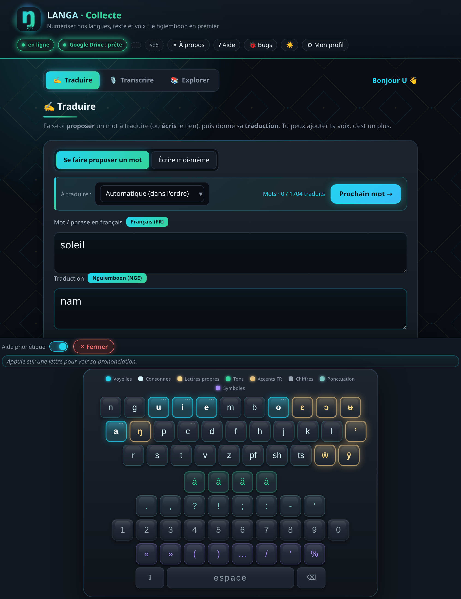
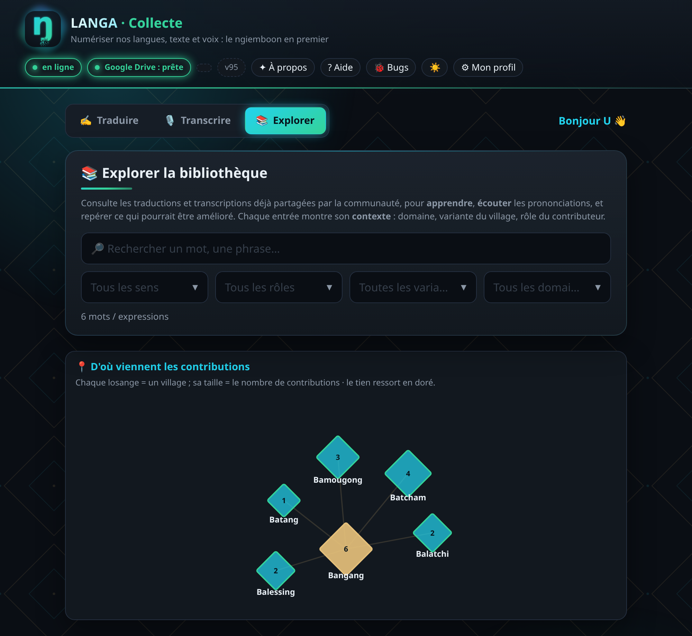

<p align="center">
  
</p>

<h1 align="center">LANGA : numériser les langues d'Afrique</h1>

<p align="center">
  <i>« la lumière » en langues nguni · texte <b>et</b> voix · par leurs communautés</i>
</p>

---

**LANGA** est un projet **de longue haleine** qui vise à rendre les langues
africaines aussi accessibles numériquement que le français ou l'anglais, **à
l'écrit comme à l'oral**. Il est **ouvert à tous** : où que l'on soit, un simple
téléphone ou ordinateur suffit pour contribuer.

La plateforme accueille **déjà plusieurs langues d'Afrique** et chacun peut y
déclarer la sienne. Le **ngiemboon** (*Ngiembɔɔn*), langue bamiléké de l'Ouest
Cameroun, est la **plus avancée** : clavier dédié et corpus le plus riche.

## Aperçu

<p align="center"><b>Accueil</b> : trois façons de contribuer (Traduire, Transcrire, Explorer).</p>
<p align="center">
  
</p>

<p align="center"><b>Traduire</b> : saisie français ↔ ngiemboon avec le clavier dédié (voyelles, lettres propres ɛ ɔ ʉ ŋ ẅ ÿ ʼ, tons á â ǎ à).</p>
<p align="center">
  
</p>

<p align="center"><b>Explorer</b> : la bibliothèque commune et la carte des variantes (d'où viennent les contributions, village par village).</p>
<p align="center">
  
</p>

## Vision (3 volets)

1. **Application de collecte de données** (la priorité actuelle) : un clavier virtuel
   ngiemboon et une application légère (Web/PWA) qui permettent aux locuteurs de
   proposer des traductions français ↔ ngiemboon et d'enregistrer leur voix. Elle
   constitue la base de textes et d'audio nécessaire pour entraîner un futur modèle.
2. **Clavier physique adaptatif** : un clavier dont la disposition s'adapte à la
   langue (piste explorée en parallèle).
3. **Modèle d'IA pour les langues africaines** : entraîné à terme sur les données
   collectées (génération, traduction, synthèse et reconnaissance de la voix).

## Démarrer l'application de collecte

```bash
python3 server/collecte_server.py      # ouvre l'URL affichée (port 8765, ou 1er libre)
```

Les contributions envoyées sont d'abord gardées **sur l'appareil** puis transmises
à la base ; le serveur local les sauvegarde **en 4 copies** (1 principale + 3
sauvegardes). En production, l'app peut aussi viser un backend **Google Apps Script**
(feuille de calcul + Drive), configurable dans `app/collecte/config.js`.

## Structure du dépôt

| Dossier | Contenu |
|---------|---------|
| `app/collecte/` | **Application de collecte** (PWA hors-ligne : formulaire FR ↔ ngiemboon + audio, stockage local, envoi robuste, Explorer, aide guidée). |
| `app/keyboard/` | **Clavier virtuel ngiemboon** (composant réutilisable ; `clavier.html` = démo autonome). |
| `app/flyer/` | Flyer promotionnel partageable (image + PDF) et QR encadré de motifs Ndop. |
| `server/` | Backend : serveur local Python (4 copies) et script Google Apps Script (production). |
| `data/` | `alphabet_ngiemboon.json` : **source unique de vérité** de l'alphabet, et seed public. |
| `scripts/` | Générateurs d'assets (données clavier, propositions, logo, flyer) et moteur de règles. |

## Alphabet (résumé)

- **8 voyelles** : a e ɛ i o ɔ u ʉ
- **24 consonnes** : b c d f g h j k l m n ŋ p r pf s sh t ts v ẅ ÿ z ʼ
- **5 tons** (accents sur la voyelle) : haut `á`, bas `a` (non marqué),
  haut-descendant `â`, montant `ǎ`, bas-descendant `à`

Les données publiées dans ce dépôt sont uniquement des éléments **libres de
droits** : la graine de vocabulaire vérifiée par l'auteur et les contributions de
la communauté.

## Licence

Le **code** est distribué sous licence **GNU Affero General Public License v3.0
(AGPL-3.0)**, voir [`LICENSE`](LICENSE). En résumé : le code reste **ouvert** ;
toute redistribution, fork ou **service en ligne** dérivé doit republier son code
source sous la même licence.

## Auteur

Brice Kengni Zanguim

© 2026 Brice Kengni Zanguim
